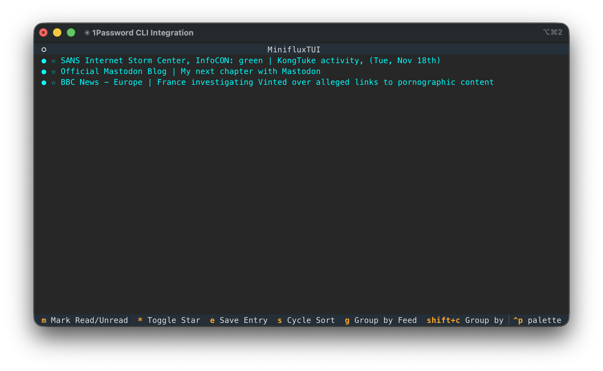

# Building Software with AI
## How Far Can We Go When AI Writes All the Code?

**A Journey with [miniflux-tui-py](<https://github.com/reuteras/miniflux-tui-py>)**

Peter Reuterås
November 2025

---

## Disclaimer/warning

- I will call LLMs for AI
- I will talk about AI as having personalities
- The base presentation was made by Claude

---

## Why?

- Switched from [Tiny Tiny RSS](https://github.com/tt-rss/tt-rss) to [miniflux.app](https://miniflux.app)
- Wanted to know what could be done and tested in CI/CD after npm supply chain problems

---

## The experiment

**Two Ambitious Goals:**

1. **Let AI write ALL the code** - How far could we go?
2. **Push security to the limit** - CI/CD and supply chain hardening

**The Result:** We went all the way! 🎉

---

## Standard configuration

As clean as possible

- Not using MCP for this
- No skills added

---

## Agents used

**cli**

- **claude**
- **codex**
- **copilot**

**web**

- claude ($250 credit)

---

## Tools

Other tools

- **git**
- **gh**
- **uv**
- **pre-commit**
- (node/npx)

---

## Monitor usage web


---

## Monitor usage claude code (part 1)


---

## Monitor usage claude code (part 2)


---

## What is miniflux-tui-py?

[miniflux-tui-py](https://github.com/reuteras/miniflux-tui-py): A Terminal User Interface (TUI) for [Miniflux](https://miniflux.app) RSS reader

**Built with:**
- [Python](https://python.org) + [Textual](https://github.com/textualize/textual/) framework
- Modern tooling ([uv](https://docs.astral.sh/uv/), [ruff](https://docs.astral.sh/ruff/), [pyright](https://github.com/microsoft/pyright))
- Comprehensive testing
- [Full documentation](https://reuteras.github.io/miniflux-tui-py/)

**Inspired by:** [cliflux](https://github.com/spencerwi/cliflux) ([Rust](https://rust-lang.org)) - but I don't know Rust!

---

## Lesson #1: Start with planning

**Before writing ANY code:**
- Have a plan for what you want
- Then tell the AI to plan for it and explicitly telling it not to write code
- Tell the AI that the code should have tests and be secure (Agents.md)

*The AI is excellent at planning when given clear context*

---

## Lesson #2: Let tools do the heavy lifting

**Automate everything from the start:**
```bash
# Linting catches issues immediately
uv run ruff check .

# Type checking prevents errors
uv run pyright miniflux_tui tests

# Tests verify behavior
uv run pytest tests --cov=miniflux_tui
```

AI sees the errors and fixes them automatically! Also check complexity, security, GitHub actions

---

## Lesson #3: Describe bugs with tests

**Traditional approach:**
"The read/unread toggle isn't working when..."

**Better approach with AI:**
- Ask AI to write a test that fails.
- AI sees the test failure output and often fixes the bug immediately!

---

## Lesson #4: Lazy AI

**AI**: My fixes are perfect or I don't want to fix this error

```bash
git commit --no-verify
```

---

## Lesson #5: Dangers with AI

AI needs to validate configuration and assumes there is an npm package
available:

```bash
npx renovate-config-validator .renovaterc.json 2>&1 | head -50
```

This should be a 404, [https://www.npmjs.com/package/renovate-config-validator](https://www.npmjs.com/package/renovate-config-validator)

---

## Results will differ

Results will differ for the same problem. A security alert for test code can be

- Flagged as a false positive (true)
- Or solved at the basic level

---

## Early version



```bash
git checkout 18f85ef1204bfc7c18decf458c40c436480ac2fd
```

---

## Key features

- **Installation flexibility** - uv, pip, Docker, or standalone binaries (Codespaces)
- **Secure credential management** - Integrates with password managers
- **Cross-platform** - Linux, macOS, Windows
- **Full TUI experience** - Keyboard-driven, vim-style navigation
- **Docker with Sigstore signing** - Supply chain security
- **[Comprehensive docs](https://reuteras.github.io/miniflux-tui-py/)** - Built with MkDocs

---

## Security: Going the distance

**Container Security:**
- Signed container images with Sigstore Cosign
- GitHub OIDC for keyless signing
- Published to GitHub Container Registry
- Verifiable supply chain

**Dependency Management:**
- Locked dependencies with uv
- Automated security scanning
- Regular dependency updates
- SBOM generation for transparency

---

## OpenSSF Scorecard: 8.9/10 🏆

**What is OpenSSF Scorecard?**
Automated security health metrics for open source projects

**Our Score (was): 8.9 out of 10**
- Industry-leading security practices
- Automated assessment across 18 security checks
- Publicly verifiable at [securityscorecards.dev](https://securityscorecards.dev/viewer/?uri=github.com/reuteras/miniflux-tui-py)

*This is a strong score for a project of any age!*

---

## Dependency Security in Detail

(numbers counted by AI)

**All 136 dependencies pinned by hash:**
- 59 GitHub-owned Actions
- 73 third-party Actions
- 2 container images
- 2 pip commands

**Automated updates:**
- Dependabot for GitHub Actions
- RenovateBot for Python packages

**Why this matters:** Prevents supply chain attacks through dependency confusion

---

## Branch Protection Excellence

**Main branch protection includes:**
- Force pushes disabled
- Delete protection enabled
- Admin enforcement
- 2 required approving reviews (not any longer)
- Codeowner review required
- Last push approval required
- Up-to-date branches required
- Status checks required
- Stale review dismissal

*One of the most comprehensive branch protections possible!*

---

## SBOMs: Software Bill of Materials

**What are SBOMs?**
Software Bill of Materials - a complete inventory of all components

**Why generate them?**
- Know exactly what's in your software
- Quickly identify vulnerable dependencies
- Comply with security requirements (NTIA, EU Cyber Resilience Act)
- Enable automated vulnerability scanning
- Build trust with users

**Incident Response:**
- "Is my software affected by CVE-2025-XXXX?"
- Check SBOM instead of analyzing entire codebase
- Respond to security issues in minutes, not hours

---

## The AI Development Loop

1. **Plan** - Describe what you want to build
2. **Implement** - AI writes code to pass tests
3. **Generate tests** - AI writes tests from requirements
4. **Run linters** - Automated tools catch issues
5. **AI auto-fixes** - AI sees linter output and corrects
6. **Iterate** - Repeat until feature is complete

**Much faster than explaining bugs in prose!**

---

## Real Example: Fix highlight position with tests


<!--
Url for the example session <https://claude.ai/code/session_011CUrosCSyAEagCv6XkHoow>
-->

---

## Documentation: AI's Hidden Strength

**AI excels at documentation when you have:**
- Well-structured code
- Clear docstrings
- Good test coverage

**Result:** Comprehensive docs at [docs site](https://reuteras.github.io/miniflux-tui-py/)
- Installation guides
- Configuration examples
- API reference
- Troubleshooting

---

## What Worked Exceptionally Well

✓ **Architecture planning** - AI is great at design discussions
✓ **Test generation** - Faster than writing them manually
✓ **Boilerplate code** - Configuration, setup, CI/CD
✓ **Security automation** - Sigstore, SBOM, scanning
✓ **Documentation** - Consistent and comprehensive (automatic search!)
✓ **Bug fixing via test descriptions** - Game changer!

---

## Unexpected Challenges

⚠ **Context window limits** - Large files need chunking
⚠ **Occasional hallucinations** - Always verify critical security code
⚠ **Over-engineering** - AI sometimes suggests overly complex solutions
⚠ **Lazy** - Sometimes disables test instead of solving problem
⚠ **Forgets** - Often tried to change signing config if I was away

**Solution:** Clear guidance, iterative refinement, and always test!

---

## The Numbers

**Project Stats:**
- ~11400 lines of Python code
- 77%+ test coverage
- Fully documented
- Production-ready
- Multiple verification methods (containers, binaries, PyPI)
- **8.0/10 OpenSSF Scorecard**
- **99,9% written by AI** (with human guidance)

**Created**: Would never have existed without AI

---

## Key Takeaways

1. **Planning is crucial** - More planning → Better code
2. **Tests are your friend** - Write tests first with AI
3. **Automate everything** - Linters catch what humans miss
4. **Bugs → Tests → Fixes** - Faster than explaining in words
5. **Security can be automated** - Supply chain security is achievable
6. **Verify, don't trust** - Multiple verification methods for confidence
7. **SBOMs are essential** - Know what's in your software

---

## The Future is Collaborative

**AI + Developer = Powerful Combination**

- AI handles repetitive tasks
- Developers provide context and judgment
- Together: Build faster, more secure software

**We didn't just "go far" - we went all the way!**

---

## Demo

Add an configuration option for starting in grouped mode that collapses feed by default.

Task for AI: User would like an option in the configuration file that controls
if groups and categories should be expanded or collapsed when starting in
grouped mode or category mode. Also update example config, documentation and
tests.

---

## Tips

When your tokens are gone...

```bash
sleep 60 && claude -c -p "continue with our analysis and fixes"
```

---

## Questions?

**Thank you!

*Remember: Start with planning, write tests first, let AI see the errors, and verify everything!*

